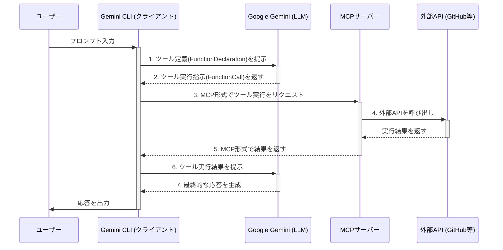

## はじめに

現在開発中のAIエージェントに、外部ツール連携の仕組みとしてMCP (Model Context Protocol) を導入しています。ただ、特定のMCPサーバーを利用するためのプログラムを個々に実装しているような形で柔軟性がなく、利用者が使用するMCPを自由に設定できるようにする必要がありました。そのための参考として、Google製のオープンソースツール「Gemini CLI」がどのようにMCPを扱っているかを調査しました。

本記事は、その際の調査結果をまとめたものです。Gemini CLIの内部実装（TypeScript）を追いながら、MCPサーバーへの接続からツール実行までの具体的な流れを確認していきます。

この記事の想定読者は以下のような方々です。

- MCP対応のAIエージェントを自作しようとしている開発者
- MCP (Model Context Protocol) のアーキテクチャに興味がある方

:::message
この記事は、筆者がGemini CLIのソースコードを調査した際の個人的なメモを元に構成したもので、文章も大部分をGemini CLIが記述しています。内容の正確性には注意を払っていますが、正確でない情報が含まれる可能性があります。より正確かつ最新の情報は、記事末尾の参考リンクをご確認ください。
調査と文章化のプロセス:

1. Gemini CLIにコードベースやdocsを読ませる
2. まとめファイルを作ってもらい、適宜こちらでドキュメントや実装を確認
3. 概念や仕組みで理解が追い付かない部分は公式ドキュメントや平易な記事などをまとめてもらって確認
4. 最終的にまとめた資料から文章を生成し、手直し

:::

## MCP (Model Context Protocol) とは

調査に先立って、前提となるMCPについてAnthropicの公式情報などを元に整理します。

MCPは、AIモデルやエージェント（クライアント）と、外部のツールやデータソース（サーバー）とを安全に接続するためのオープンな標準プロトコルです。従来、AIが外部APIを利用するには個別の連携実装が必要でしたが、MCPという共通規格を用いることで、その手間を大幅に削減することを目指しています。

アーキテクチャはクライアント/サーバーモデルに基づいています。

- **MCPサーバー**: 特定の機能（例: ファイル操作、DB検索、Web API連携）を提供するプログラム。MCPクライアントの設定ファイルなどに設定を記述し、`npx` や `uvx` といったコマンドでローカルに起動するツールサーバーは、こちらに該当します。
- **MCPクライアント**: MCPサーバーに接続し、その機能を利用する側のプログラム。Gemini CLIや、私たちが開発するAIエージェントがこれにあたります。

クライアントはサーバーに「どんなツールが使えるか？」を問い合わせ、サーバーはその定義を返します。クライアント（と、その内部のLLM）は、その定義を見てツールを選択し、サーバーに実行をリクエストします。

### 全体像のシーケンス図

ここまでの登場人物とやり取りの流れを、簡単な図にまとめます。



## Gemini CLIにおけるMCPツール利用のフロー

Gemini CLIのコードを調査した結果、MCPツールの利用は大きく分けて以下の流れで処理されていました。

1. **MCPクライアントの起動とツールの発見**
2. **発見したツールの内部レジストリへの登録**
3. **LLMへのツール情報提示と選択依頼**
4. **LLMの選択に基づくツール実行**

以下、各ステップをコードと共に見ていきます。

### 1. MCPクライアントの起動とツールの発見・登録

この処理は、主に `packages/core/src/tools/mcp-client.ts` に実装されていました。

Gemini CLI（クライアント）は起動時に、ユーザー設定 (`settings.json`) に基づいて `connectAndDiscover` 関数を呼び出します。この関数が、設定された各MCPサーバーへの接続、ツールの発見、そして内部のツール管理機構（`ToolRegistry`）への登録までを一貫して行います。

:::details packages/core/src/tools/mcp-client.ts

```typescript:packages/core/src/tools/mcp-client.ts
// ... (一部抜粋)
export async function connectAndDiscover(
  mcpServerName: string,
  mcpServerConfig: MCPServerConfig,
  toolRegistry: ToolRegistry,
  debugMode: boolean,
): Promise<void> {
  // ... (接続ステータス管理など)

  try {
    // MCPサーバーへ接続
    const mcpClient = await connectToMcpServer(
      mcpServerName,
      mcpServerConfig,
      debugMode,
    );
    try {
      // サーバーからツール情報を取得
      const tools = await discoverTools(
        mcpServerName,
        mcpServerConfig,
        mcpClient,
      );
      // 取得したツールをToolRegistryに登録
      for (const tool of tools) {
        toolRegistry.registerTool(tool);
      }
    } catch (error) {
      mcpClient.close();
      throw error;
    }
  } catch (error) {
    // ... (エラー処理)
  }
}

export async function discoverTools(
  mcpServerName: string,
  mcpServerConfig: MCPServerConfig,
  mcpClient: Client,
): Promise<DiscoveredMCPTool[]> {
  try {
    // @modelcontextprotocol/sdk を利用してツール定義を取得
    const mcpCallableTool = mcpToTool(mcpClient);
    const tool = await mcpCallableTool.tool();

    if (!Array.isArray(tool.functionDeclarations)) {
      throw new Error(`Server did not return valid function declarations.`);
    }

    const discoveredTools: DiscoveredMCPTool[] = [];
    for (const funcDecl of tool.functionDeclarations) {
      // ... (名前の衝突回避やパラメータのサニタイズ処理)

      // 内部表現である DiscoveredMCPTool オブジェクトを作成
      discoveredTools.push(
        new DiscoveredMCPTool(/* ... */)
      );
    }
    return discoveredTools;
  } catch (error) {
    throw new Error(`Error discovering tools: ${error}`);
  }
}
```

:::

`discoverTools` 関数内で、`mcpToTool(mcpClient).tool()` を呼び出すことで、MCPサーバーからツールの仕様（`FunctionDeclaration` の配列）を取得していることが分かります。取得された情報は、後続の処理で扱いやすいよう、Gemini CLI内部の `DiscoveredMCPTool` というクラスのインスタンスに変換された上で `ToolRegistry` に登録されます。

### 2. LLMへのツール情報提示と選択依頼

ツールが `ToolRegistry` に登録された後、その情報がどのようにLLMに渡されるのか。この部分は `packages/core/src/core/client.ts` の `startChat` メソッドに実装されていました。

対話セッションを開始する際、このメソッドは `ToolRegistry` から現在利用可能なすべてのツールの仕様、すなわち `FunctionDeclaration` のリストを取得します。`FunctionDeclaration` は、GoogleのGenerative AI SDKで定義されているオブジェクトで、以下の主要な情報を含んでいます。

- **`name`**: ツールのユニークな名前。
- **`description`**: ツールが何をするのかを自然言語で説明した文章。LLMがツールを選択する上で最も重要な情報となります。
- **`parameters`**: ツールが必要とする引数のスキーマ（型、プロパティ、必須かどうかなど）。

Gemini CLIは、取得した `FunctionDeclaration` のリストを `tools` パラメータとして整形し、LLMへのリクエストに含めます。

:::details packages/core/src/core/client.ts

```typescript:packages/core/src/core/client.ts
// ... (一部抜粋)
export class GeminiClient {
  private async startChat(extraHistory?: Content[]): Promise<GeminiChat> {
    // ...

    // ToolRegistryインスタンスを取得
    const toolRegistry = await this.config.getToolRegistry();
    // Registryから全ツールのFunctionDeclarationを取得
    const toolDeclarations = toolRegistry.getFunctionDeclarations();
    
    // Gemini APIが要求する形式 (Tool[]) に整形
    const tools: Tool[] = [{ functionDeclarations: toolDeclarations }];
    
    // ...

    try {
      // GeminiChatの初期化。この中でツール定義がLLMに渡される
      return new GeminiChat(
        this.config,
        this.getContentGenerator(),
        {
          // ... (システムプロンプトなどの設定)
          tools, // <--- ここで整形したツール定義を渡す
        },
        history,
      );
    } catch (error) {
      // ... (エラー処理)
    }
  }
}
```

:::

LLMは、この `tools` パラメータで渡された情報（特にツールの `description`）とユーザーのプロンプトを解釈し、どのツールを使うべきかを判断します。そして、使用すべきツールとその引数を `FunctionCall` オブジェクトとして返却します。

この仕組みにより、CLIはLLMにツールの選択を委任しています。

### 3. LLMの選択に基づくツール実行と結果の処理

LLMが `FunctionCall` を返却すると、いよいよツールの実行フェーズに移ります。ここからの処理は、単にMCPサーバーを呼び出すだけでなく、その結果を再びLLMにフィードバックするまでの一連の流れになっています。

1. **`FunctionCall` の解析**: Gemini CLIのコア部分は、LLMから返された `FunctionCall` オブジェクト（呼び出すべきツール名と引数を含む）を解析します。

2. **ツールの検索と実行**: CLIは、ツール名を使って `ToolRegistry` から対応する `DiscoveredMCPTool` インスタンスを検索し、その `execute` メソッドを呼び出します。

3. **MCPサーバーへのリクエスト**: `execute` メソッドの内部で、LLMから受け取った引数を元に、今度はCLI内部でMCPサーバーへ送るための新たな `FunctionCall` オブジェクトが作成されます。このオブジェクトが `@modelcontextprotocol/sdk` ライブラリを通じて、対象のMCPサーバーに送信されます。

4. **結果の受け取りと整形**: ツールを実行したMCPサーバーは、その結果を返します。`DiscoveredMCPTool` はサーバーからの結果を受け取ると、それを次の2つの情報に整形してCLIのコアに返却します。
    - **`llmContent`**: LLMが次の応答を生成するために必要な、ツールの実行結果そのもの。
    - **`returnDisplay`**: ユーザーの画面に表示するための情報（例：「ファイルに書き込みました」）。

5. **LLMへのフィードバック**: 最後に、整形されたツールの実行結果（`llmContent`）が再びLLMに送られます。LLMは、その実行結果を踏まえて、ユーザーへの最終的な応答メッセージ（例：「ご指示の通り、`sample.txt` に内容を保存しました。」）を生成します。

このように、Gemini CLIはLLMとの間で「ツールは何か？（`FunctionDeclaration`）」「どのツールを使うか？（`FunctionCall`）」「使った結果どうだったか？（ツールの実行結果）」という一連の対話を行うことで、ツール連携を実現しています。

## まとめ

Gemini CLIのソースコード調査から、MCPを利用したツール連携の具体的な実装フローが確認できました。

- **プロトコルによる疎結合**: MCPという規約を介すことで、CLI本体（クライアント）とツール提供プログラム（サーバー）を分離している。
- **動的なツール登録**: 起動時に設定されたサーバーをスキャンし、利用可能なツールを動的に内部レジストリへ登録する。
- **LLMへのコンテキスト提示**: 対話の都度、登録済みツールの一覧を `FunctionDeclaration` としてLLMに渡し、ツールの選択を委ねる。

Gemini CLIのような完成度の高いツールの中身がオープンソースで公開されていて、モノづくりの参考にできるのはとてもありがたいですね。システムプロンプトなども読んで参考にしています。
他にオープンソースのコーディングエージェントでOpenCodeなどもありますし、比較してみるのも面白そうだなと思いました。

また、今回はエラーや例外の処理についてまでは手が回らなかったので、こちらも追々調べられればと思っています。

長文でしたが、最後までお付き合いいただきありがとうございました。

## 参考リンク

- **Gemini CLI 公式サイト**: [https://gemini.google.com/cli](https://gemini.google.com/cli)
- **Gemini CLI GitHubリポジトリ**: [https://github.com/google/gemini-cli](https://github.com/google/gemini-cli)
- **Anthropic | Model Context Protocol**: [https://docs.anthropic.com/claude/docs/model-context-protocol](https://docs.anthropic.com/claude/docs/model-context-protocol)
